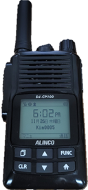

e제이코어(eJCore) 팀
====================
## 팀소개
* 이종형 제어코어 대표 jhl@jcore.co.kr
  + 기획, HW 및 SW 개발
* 차유정 이사 cha@jcore.co.kr
  + HW 개발
* 김재명 책임연구원 jmketri@gmail.com
  + SW 개발
  + 정년퇴직 준비 중
> ★ DJ-CP100 단말 양산준비로 인해 해커톤에 불참 

> ☆ 대표로 김재명 책임만 참석
___
## 개발 필요성

* Quectel EC25J 칩 기반 Quectel QuecOpen development platform 활용
* **최신 음성 인식 기술**을 추가하여 **NTT도코모의 아성**에 도전
___
## 설계 분석
### < STT (Speech-to-Text) 기능 구현의 한계 >

<!-- 테이블 -->
|플랫폼|단점|비고|
|:--:|:--|:--|
|QuecOpen|<ul><li>python환경 없음</li></ul>|<ul><li>ALSA 대신 Quec Solution 사용</li></ul>|
|라즈베리파이|<ul><li>마이크 없음</li><li>python 활용</li><ul>|<ul><li>USB 마이크 사용</li></ul>|
|MCU|<ul><li>python환경 없음</li></ul>|<ul><li>WIFI</li><li>Mic/Speaker</li><li>STT_API 구현 필요</li></ul>|
|
### < STT(Speech-to-Text) 기능 한계 극복 방안 >

* 개인 음성에 특화된 End-to-End Machine Learning 환경 제공
    + 개인 특정 음성 파일 입력
    + 음성 인식 모델 생성
___
## 해커톤 목표
* 목표구성도
  - IoT보드에서 음성 입력
  - 음성을 AWS Transcribe를 통해 기능 호출(STT)
  - 결과 text를 LCD에 출력
___
## 사전 워크숍
* 2020.12.12 / Cat.M1
  + Quectel BG96 칩 사용
  + AT 명령어 활용
  + SK Cat.M1 보드로 시험
* 2020.12.13 / STM32CubeMX&IDE (CodeZoo 한기태 이사)
  + 보드 : B-L4S5I-IOT01A
  + chipset : STM32L4S5VIT6
  + clock 설정 : 120 MHz
  + GPIO 설정
    - GREEN_LED 제어 : PB14 GPIO Output
  + build, download 등 사용법
  + Interupt 설명
* 2020.12.19 / STM32CubeMX&IDE
  + USER_BUTTON : PC13 EXTI
  + UART 통신
    - PB10,9을 PB6,7로 변경 방법
    - PB6 - ST-LINK-UART1 Tx
    - PB7 - ST-LINK-UART1 Rx
  + 문자 출력 printf
  + Interrupt 방식 출력
  + Formatted Input : scanf
    - 참조: [4-5강 UART - TrueStudio에서 scanf 사용하기](https://blog.naver.com/rhoblack/221449235824)
  + Timer - LED2 제어
  + Timer PWM (Pulse Width Modulation)
    - duty cycle
  + I2C (Inter-Integrated Circuit)
    - LSM6DSL 6축 센서 (3D accelerometer and 3D gyroscope)
    - 참조: [Getting started with STM32Cube.AI and motion sensing on the STM32L4 IoT node](https://wiki.st.com/stm32mcu/wiki/Getting_started_with_STM32Cube.AI_and_motion_sensing_on_the_STM32L4_IoT_node)
  + X-CUBE-AI
    - X-Cube-AI Core Engine
    - X-Cube-AI Overview
    - Quantization Flow
    - X-CUBE-AI 설치 - 간단
  + Hello World Model (sine model) 생성
    - 참조: 초소형 머신러닝 TinyML (한빛미디어)
    - 참조: TinyML: Machine Learning with TensorFlow Lite on Arduino and Ultra-Low-Power Microcontrollers (O'REILLY)
* 2020.12.20 / STM32CubeAI
  + CubeAI - SINE MODEL PROJECT - 보드 동작 과정 설명
  + Motion Sensing 실습
* 2020.12.21 / AWS 서비스 설명
* 2020.12.22-23 / FreeRTOS on STM32
  + MOOC - FreeRTOS on STM32 [번역] - 시청
* 2020.12.24 / AWS FreeRTOS & AWS IoT 기술워크숍
  + Free RTOS & AWS IoT 기술워크숍 (1 2, OTA Firmware Update 실습 오류 포함) - 동영상 시청 및 Hands-On
* 2020.12.26 / STM32 ↔ RPi ↔ Cloud(AWSIoT, Thingspark)
  + TTL USB Connector
  + 라즈베리파이를 통한 Thingspark 접속
* 2020.12.27 / STM32 ↔ Cloud(Thingspark)
  + WIFI 설정
  + Thingspark 접속
___
## 목표 접근을 위한 준비
- [ ] WIFI 접속
  + 방진석 책임 포팅: [Devin Brown 제공 API](https://github.com/devinbrown7/BSP_B-L475E-IOT01)
  + X-CUBE-AWS 패키지 활용: [AWS IoT software expansion for STM32Cube (UM2178)](https://www.st.com/en/embedded-software/x-cube-aws.html)
- [ ] Audio 사용
  + 참조: [MOOC - STM32L4 hands-on workshop](https://www.youtube.com/watch?v=LfE0LiwE1VU&t=703s)
    + 오디오 재생 실패 : step 1-6 중 step 3 file system 추가 부문에서 오류
  + X-CUBE-AWS 패키지 활용
    + 참조: [Getting started with XCUBE VS4A (Alexa Voice Service)](https://y2u.be/u2Zu5G0PHx8)
___
## 해커톤에서 한 일
### Nextion을 이용한 결과 화면 구성
결과 확인 화면 
* 참조 자료
  + Nextion Display 설정: [Nextion HMI를 이용한 Touch GUI 쉽게 사용하기](https://y2u.be/sak-Z84CiCs)
  + STM32 Nextion LCD 연동: [Nextion Display interface with STM32 Microcontroller](https://y2u.be/boTvqds1xBU)
### Alexa @ Raspberry Pi 4
**[Alexa 구동 장면](https://youtu.be/879WQAqE730)**
* 참조: [HOW TO INSTALL ALEXA ON RASPBERRY PI 3](https://y2u.be/zSiR81RQiu0)
### IoT 보드 구동
미완성 작품
___
## 해커톤 후 할 일
* Mic/Spk 제어
* Alexsa Transcribe
  + **Recognize_google**로 변경 필요
* DJ-CP100 적용
  - Recognize_google 사용 확인
  - TinyML 음성 모델 생성
  - 적용 및 시험
___